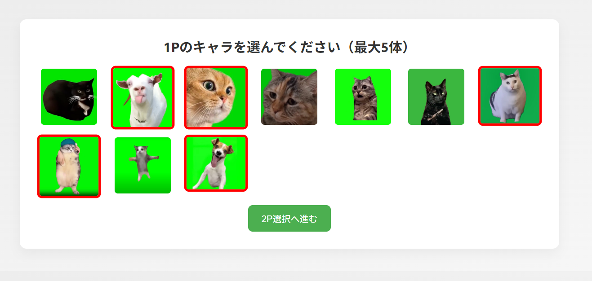
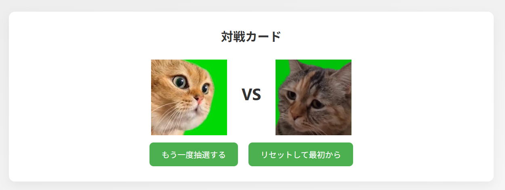

# Meme Fighter Picker 🐱🎮  
「猫ミーム格闘キャラ抽選器」

🔗 [デモページはこちら](https://tsushima-r.github.io/Meme-Fighter-Picker/)

作品は日々増やしています。最新の制作物は [GitHubのプロフィールページ](https://github.com/tsushima-r) からご覧いただけます。

---
## 📸 スクリーンショット  

### 🏠 ホーム画面  

---

## 📌 概要  

◆この作品は、AIと一緒に楽しみながら作った**実験的なプログラム**です。  
ChatGPTとのやり取りを重ねながら、**まるで共同作業のように数時間で形にすることができました。**

自作とは言えないかもしれませんが、  
「**こういう形でもひとつの作品が成立する**」のは、とてもおもしろい！と思っています。

◆自分でプレイする格闘ゲームのキャラクターをランダムに抽選するために作りました。
ゲーム内の「おまかせ機能」では、**苦手なキャラまで選ばれてしまう**ため、**自分が使えるキャラ**の中からだけランダムに選びたいために開発しました。

---

## 🐱 猫ミームキャラについて  

GitHubに公開するにあたり、  
**著作権上の懸念を避けるため、実在のゲームキャラではなく猫ミームキャラを仮設定**として使用しています。

---

## 🧪 技術的要素  

- HTML + CSS + JavaScript のシンプルな構成  
- キャラリストからのランダム選出（重複なしロジック）  
- プレイヤーごとに5体までキャラ選択可能  
- シンプルなUIで操作性を重視  
- サウンド再生機能付き（効果音）

---

